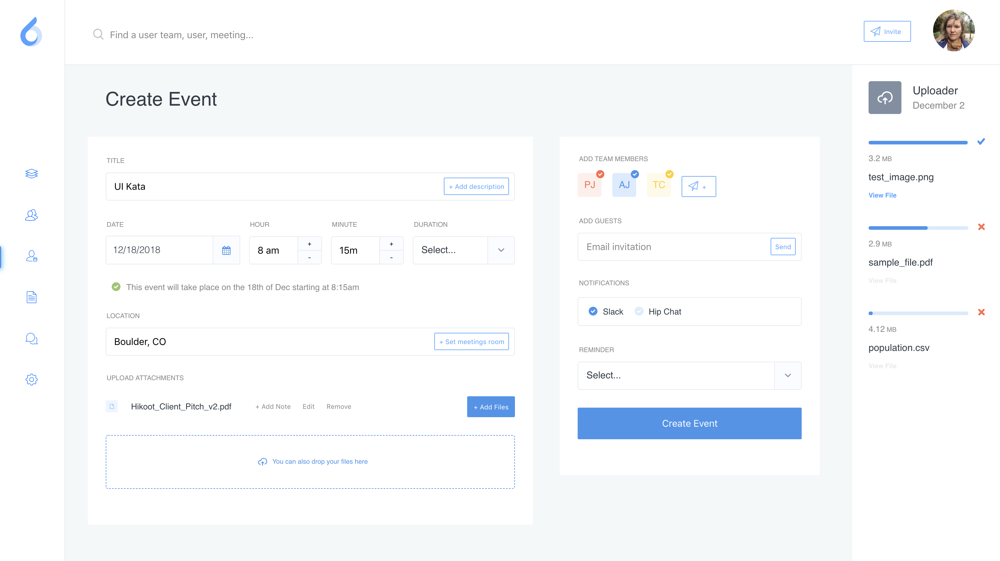

## Productivity UI

- [Live UI](https://topleft.github.io/events)
- [Sketch File](https://dribbble.com/shots/3414415-ooto-Productivity-Dashboards/attachments/746493)

## UI Kata

This is part of my UI Kata learning initiative. I find sketch files of UI's on the internet and code them up. With this project I focused on:

 - React component structure
 - High quality CSS
 - Component testing ... TODO ;)

## Design

Thanks to **Adrian Madacs** for the excellent design and sketch files.
- [Dribble Profile](https://dribbble.com/madacs_a)
- [Linkedin Profile](https://www.linkedin.com/in/adrian-madacs-306045b7/)

## Feedback

Have a look at the code and let me know what you think. Thanks!
